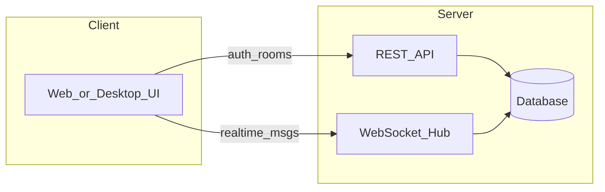

# Echo | 에코

> **Echo messages in real time** — 실시간으로 메시지가 메아리치다

개발자 포트폴리오용 **실시간 그룹 채팅 + 1:1 DM** 메신저 프로젝트입니다.

---

## 프로젝트 개요

Discord/Slack 라이트 수준의 메신저로, 인증·채팅방·실시간 메시징·DB 영속화를 한 번에 보여주는 것을 목표로 합니다.

| 항목 | 내용 |
| :--- | :--- |
| 유형 | 실시간 그룹 채팅 + 1:1 DM |
| 저장소명 | `Echo` |
| 기술 스택 | TBD (구현 착수 전 확정) |

---

## MVP 기능 범위

### 필수 (Phase 1)

| 기능 | 설명 |
| :--- | :--- |
| 회원가입 / 로그인 | JWT 또는 세션 기반 인증 |
| 채팅방 | 생성 · 초대 · 목록 조회 |
| 실시간 메시지 | WebSocket 기반 송수신 |
| 메시지 영속화 | DB에 메시지 저장 및 히스토리 조회 |
| 온라인 상태 | 접속/오프라인 표시 |
| 타이핑 표시 | 상대방 입력 중 표시 |

### 선택 (Phase 2)

| 기능 | 설명 |
| :--- | :--- |
| 이미지 업로드 | 채팅 첨부 파일 |
| 읽음 표시 | 메시지 읽음 여부 |

---

## 아키텍처 (예정)



---

## 기술 스택 후보

| 방향 | 구성 | 비고 |
| :--- | :--- | :--- |
| 웹 (권장) | ASP.NET Core SignalR + React/Blazor 또는 Next.js | 포트폴리오 범용성 높음 |
| C# 데스크톱 | WinForms/WPF + SignalR | 기존 C# 스택 활용 |
| 모바일 포함 | Flutter + 백엔드 API | 크로스플랫폼 |

---

## 프로젝트 구조 (예정)

```
Echo/
  README.md
  Echo.Server/     # API + WebSocket Hub
  Echo.Client/     # 웹 또는 데스크톱 클라이언트
```

---

## 시작하기

> 스택 확정 및 구현 후 업데이트 예정

```bash
cd Echo
# TBD
```

---

## 라이선스

MIT (추가 예정)
